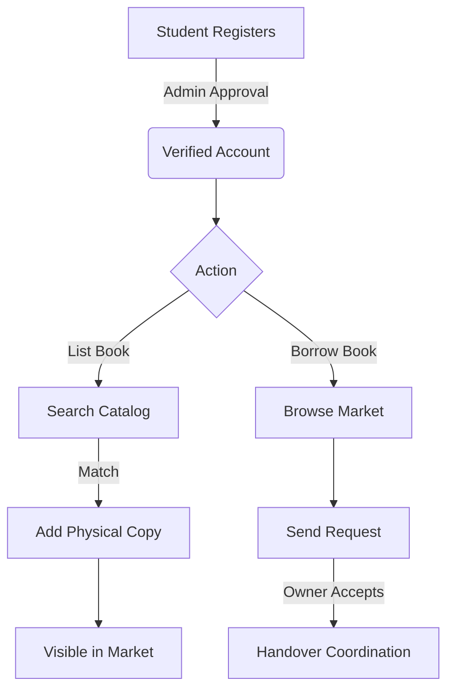

# BookOrbit 📚

<p align="center">
  <b>A seamless book-sharing ecosystem built for the modern student.</b>
  <br />
  <a href="#how-it-works">How it works</a> •
  <a href="#key-features">Key Features</a> •
  <a href="#getting-started">Getting Started</a> •
  <a href="#roadmap">Roadmap</a>
</p>

<p align="center">
  
  
  
</p>

---

### Why BookOrbit?

Let's be honest: buying brand-new textbooks every semester is a drain on your wallet, and watching them gather dust after finals is even worse. **BookOrbit** is built to break that cycle. 

It’s a platform designed by students, for students, to facilitate easy, cost-free lending and borrowing within your university community. No more overpriced used-book stores or sketchy social media group meetups—just a clean, organized marketplace where books find their next reader.

---

### 🚀 Key Features

*   **Smart Cataloging**: Don't waste time typing details. Search our global catalog to list your copy in seconds.
*   **Student-Only Access**: Secure, university-verified accounts. Every user is vetted by an admin to keep the community safe.
*   **Lending Management**: Track your requests, manage your library, and coordinate handovers through a streamlined dashboard.
*   **Premium Visuals**: A modern, responsive interface featuring dark mode support, smooth motion effects, and a custom-built 3D orbit system.
*   **Admin Control**: A robust suite of tools for moderation, book approval, and user management.

---

### 🛠️ Tech Stack

| Layer | Technology |
| :--- | :--- |
| **Frontend** | React 19, React Router 7, Framer Motion |
| **Styling** | Tailwind CSS, Lucide Icons |
| **State & Logic** | Context API, React Hook Form, SignalR (Real-time) |
| **Backend Communication** | Axios, JWT-based Auth (Access & Refresh tokens) |
| **Verification** | React Hot Toast, Custom Preloaders |

---

### 📂 Project Structure

```bash
src/
├── components/     # UI elements, Layouts, and Shared components
├── context/        # Auth and Real-time Chat state management
├── hooks/          # Custom hooks for media queries and logic
├── pages/          # Core views: Admin, Books, Dashboard, and Auth
├── services/       # API abstraction layer
├── utils/          # Constants and helper functions
└── index.css       # Global styles and custom animations
```

---

### 💻 Getting Started

Getting BookOrbit running locally is straightforward.

1.  **Clone & Install**
    ```bash
    git clone https://github.com/your-username/bookorbit.git
    cd bookorbit
    npm install
    ```

2.  **Environment Setup**
    Copy the example environment file and fill in your API endpoints.
    ```bash
    cp .env.example .env
    ```

3.  **Launch**
    ```bash
    npm start
    ```

The application will be live at `http://localhost:3001`.

---

### 🔄 The Lifecycle



---

### 🛣️ Roadmap

- [ ] **Real-time Comms**: Integrated messaging to coordinate book swaps without leaving the app.
- [ ] **Push Notifications**: Get alerted instantly when your request is accepted or a new book drops.
- [ ] **Reputation System**: Peer-to-peer ratings to build trust within the lending community.
- [ ] **Mobile Experience**: Dedicated iOS and Android versions via Capacitor/React Native.
- [ ] **Map Integration**: Visualize available books on your campus map.

---

### 🤝 Contributing

Contributions are what make the open-source community such an amazing place to learn, inspire, and create. Any contributions you make are **greatly appreciated**.

1. Fork the Project
2. Create your Feature Branch (`git checkout -b feature/AmazingFeature`)
3. Commit your Changes (`git commit -m 'Add some AmazingFeature'`)
4. Push to the Branch (`git checkout push origin feature/AmazingFeature`)
5. Open a Pull Request

---

<p align="center">
  Built with ❤️ for the student community.
</p>
